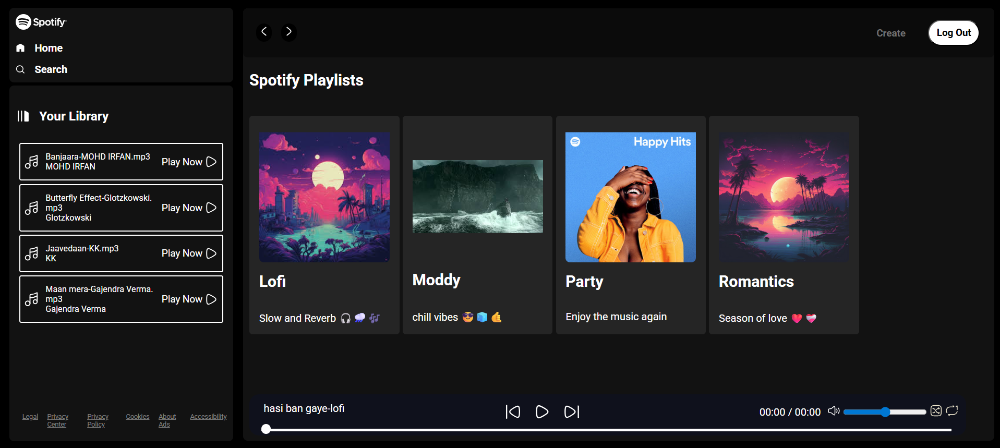

---

# 🎵 Spotify Clone (HTML, CSS, JS + Node.js, Express, MongoDB)

This project is a **Spotify-inspired music player web application** built using **HTML, CSS, and JavaScript** for the frontend, and **Node.js, Express, and MongoDB** for the backend.
It provides authentication, secure song handling, dynamic playlist creation (locally), and a modern music player UI with interactive controls.
The application is deployed on **Render** for production use.

---

# 🎵 Spotify Clone Preview



---

## 🚀 Features

* 🗂 **Dynamic Playlist Creation (Localhost only)** – Create playlists dynamically.
* 🔒 **Authentication with JWT** – Secure login and route protection.
* 🎶 **Secured Songs Database** – Songs and playlists are served only via authenticated requests.
* 📝 **Server Logs** – Tracks all requests and stores them in `/server_logs`.
* 🌐 **Deployment Ready** – Hosted on **Render**.

### 🎵 Music Player Controls (Frontend with HTML/CSS/JS)

* ▶️ **Play / Pause** – Start and stop songs.
* 📱 **Responsive Design** – Works smoothly on mobile, tablet, and desktop.
* ⏮️ **Previous / Next** – Skip tracks easily.
* 🔊 **Volume Control** – Adjust volume using slider.
* 🔁 **Repeat** – Replay the same track.
* 🔀 **Shuffle** – Randomize the order of songs.
* 📍 **Seekbar** – Move forward/backward within a song.

---

## ⚙️ Instructions

1. **Setup Environment Variables**
   Create a `.env` file in the root directory:

   ```env
   MONGO_URI=your_mongo_connection_string
   PORT=3000
   JWT_SECRET=your_secret_key
   ```

2. **Frontend Config**
   Change the host URL in:

   ```
   public/scripts/script.js
   ```

---

## 🛠️ Testing

* Tested on **Postman**.
* POSTMAN link **https://tejas-dhangar-s-team.postman.co/workspace/Team-Workspace~8c11711c-0e3d-459e-8661-7d53eb65984b/collection/47851636-3e08e5e1-b8e9-45f5-9604-c9998f8f6a23?action=share&creator=47851636**.

---

## 🌐 Deployment

* Deployed on **Render**.
* Deployed link **spotify-project-7f8n.onrender.com**.
* Update **CORS settings** and **cookie security** (`sameSite none`, `secure false`) for LOCAL in routes/login.js.

---
